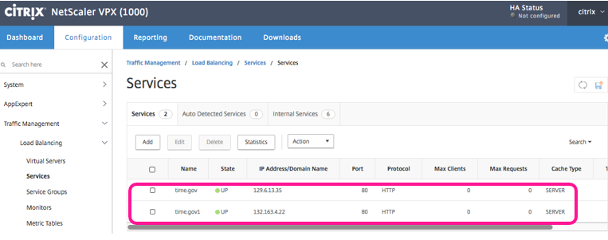
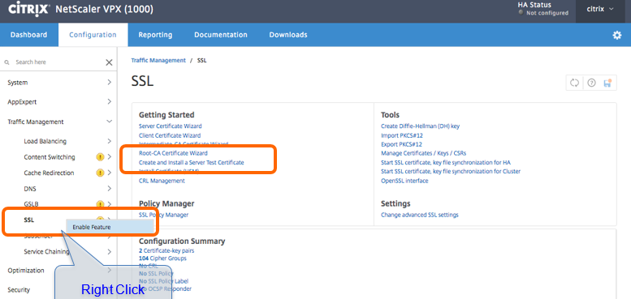
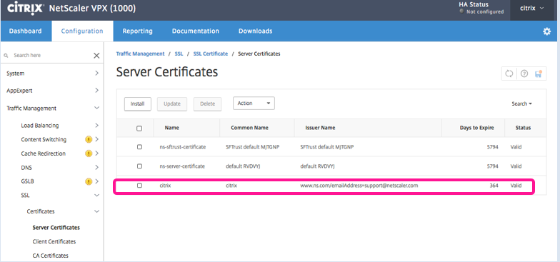
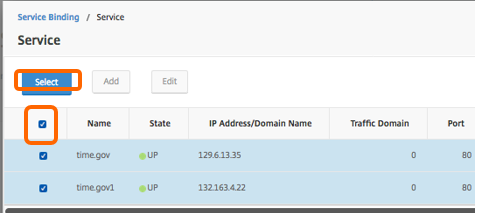
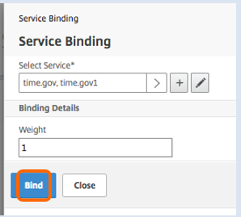
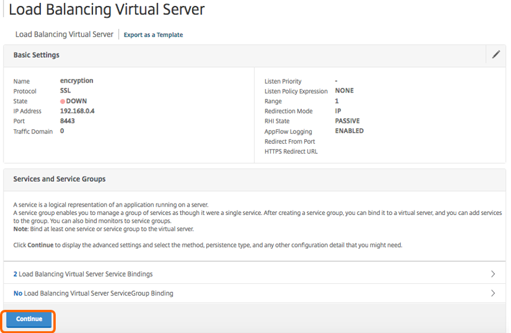
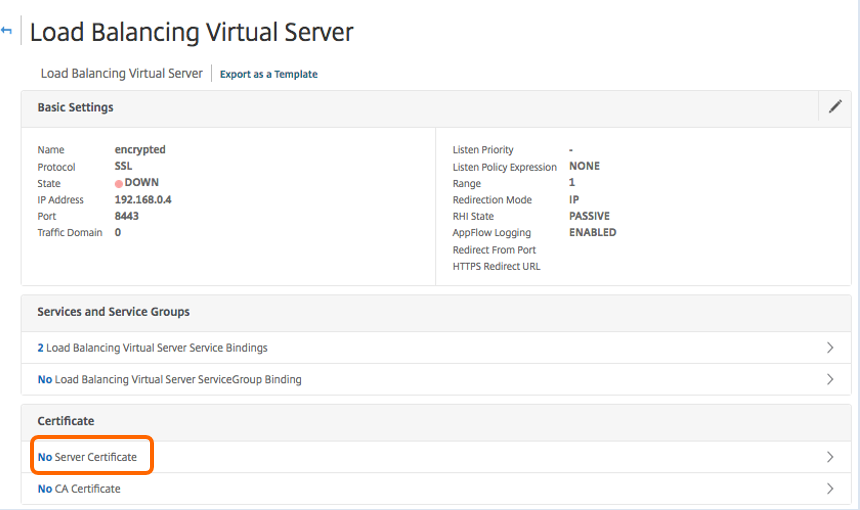
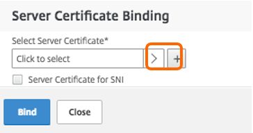
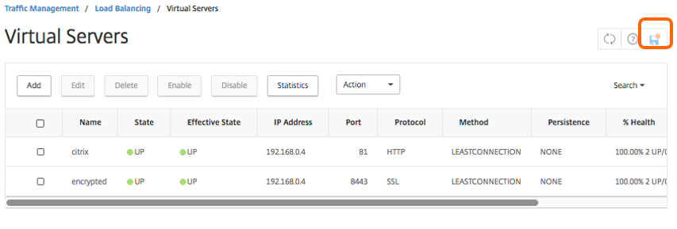
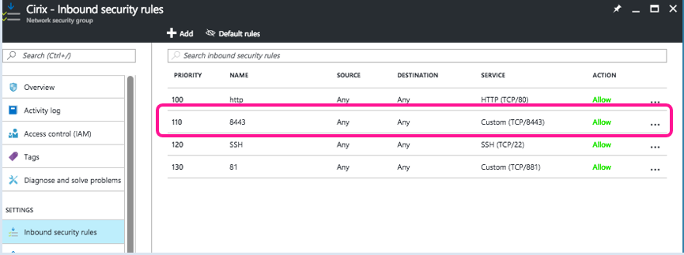

# Lab Guide Appendix

## Bonus Exercise: Add Encryption to this app with a HTTPS vServer.

### Overview

NetScaler is a Secure Reverse Proxy doing Layer 7 Request Switching for the above HTTP Application. We could do HTTPs on either side, or both, as needed. Since our Service in this lab is just HTTP, let’s leave it for convenience, but it would make sense to go SSL on both sides, since the client and the server are out on the Internet. Let’s focus on adding SSL to the front side, where we would have the FQDN and Certificate with the DNS forwarding to our NetScaler’s public IP. We can roll at test certificate quickly and add a browser security exception.

### In this exrcise you will:

* Configure a HTTPS vServer in front of your proxied application

* Add another Service for Load Balancing

**Estimated time to complete this exercise:** 10 Minutes

### Step by Step Guidance

1. For high availability, lets add another service. Time.gov has a few IPs they work on. Add another Service under Traffic management for 129.6.13.35.

    

2. We can add a SSL Test Cert, but first should enable SSL by right clicking on the feature under Traffic Management. Then, click on create and install a server test cert, on the main SSL screen.

    

3. Name your cert, and make up a FQDN, as we will just hit it by IP for now and add a security exception on the browser. We are using a simple site and negate the need for DNS updates or host files to make this lab functional.

    

4. Your Certificate should appear under Server Certificates

    

5. Navigate back to Traffic Management, Virtual Servers and let’s add another.

    

6. Use the same single IP, and specify a different port. I used 8443 and selected SSL for the type. 

    

7. Click on the “No Load Balancing Virtual Server Service Binding” line to add our 2 HTTP Services for time.gov.

    

8. Click > to select.

    

9. Select both by check box and then click select.

    

10. Click Bind.

    

11. We do not expect a SSL type vServer to come ‘up’ until we bind a certificate to it. Click Continue. 

    

12. Next, click on ‘No Server Certificate”.

    

13. Click the > to select. 

    

14. Select your Certificate.

    

15. Click Bind.

    

16. Scroll to the bottom and click Done.

    

17. They are both up now. Go ahead and click on the save icon. 

    

18. Add a inbound security rule on the Azure Network Security Group for public Azure IP:8443

    

19. Let’s try. https://157.56.13.96:8443. I added a security exception on my browser because, as expected, this server test cert us not trusted and has no CA and no matching FQDN. I could do my CSR on the NetScaler and fix that. I can also aggregate my certificates and manage them with NetScaler Management and Analytics System. The SSL Cert Management features are strong value. More information on NetScaler MAS is linked below.

    

### Exercise Summary

You provisioned Azure, instantiated and licensed a NetScaler VPX, configured Server Load Balancing, and then added encryption for your legacy application with a SSL vServer. If you tie a legitimate FQDN and Certificate to your IP and NetScaler, you could proceed to dialing it in for the SSL Labs A+ rating. https://www.citrix.com/blogs/2016/06/09/scoring-an-a-at-ssllabs-com-with-citrix-netscaler-2016-update/.

## Additional Resources and Information

https://www.citrix.com/products/netscaler-adc/resources/deploy.html

https://docs.citrix.com/content/dam/docs/en-us/workspace-cloud/downloads/NetScaler-VPX-in-AZURE-Deployment-Guide.pdf

https://www.citrix.com/products/netscaler-management-and-analytics-system/

### Certificate Management

[How to Configure an Enterprise Policy on NetScaler MAS](https://docs.citrix.com/en-us/netscaler-mas/11-1/certificate-management-how-to-articles/how-to-configure-enterprise-policy.html)

[How to Install SSL Certificates on a NetScaler Instance from NetScaler MAS](https://docs.citrix.com/en-us/netscaler-mas/11-1/certificate-management-how-to-articles/how-to-install-ssl-certificates-on-netscaler-instance.html)

[How to Update an Installed Certificate from NetScaler MAS](https://docs.citrix.com/en-us/netscaler-mas/11-1/certificate-management-how-to-articles/how-to-update-an-installed-certificate.html)

[How to Link and Unlink SSL Certificates by Using NetScaler MAS](https://docs.citrix.com/en-us/netscaler-mas/11-1/certificate-management-how-to-articles/how-to-link-and-unlink-ssl-certificates.html)

[How to Create a Certificate Signing Request (CSR) by Using NetScaler MAS](https://docs.citrix.com/en-us/netscaler-mas/11-1/certificate-management-how-to-articles/how-to-create-csr.html)

[How to Set Up Notifications for SSL Certificate Expiry from NetScaler MAS](https://docs.citrix.com/en-us/netscaler-mas/11-1/certificate-management-how-to-articles/how-to-set-up-notificationsfor-ssl-certificate-expiry.html)

[How to Use the SSL Dashboard to Monitor Certificates from NetScaler MAS](https://docs.citrix.com/content/docs/en-us/netscaler-mas/11-1/certificate-management-how-to-articles/how-to-use-ssl-dashboard-to-monitor-certificates)

[NetScaler MAS data sheet](https://www.citrix.com/content/dam/citrix/en_us/documents/data-sheet/netscaler-mas-data-sheet.pdf)

