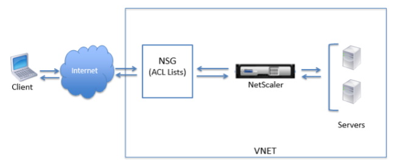
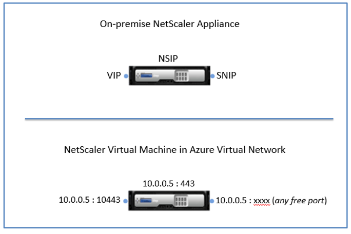
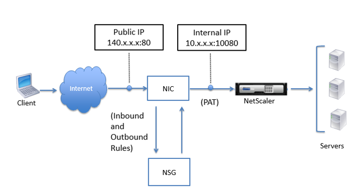
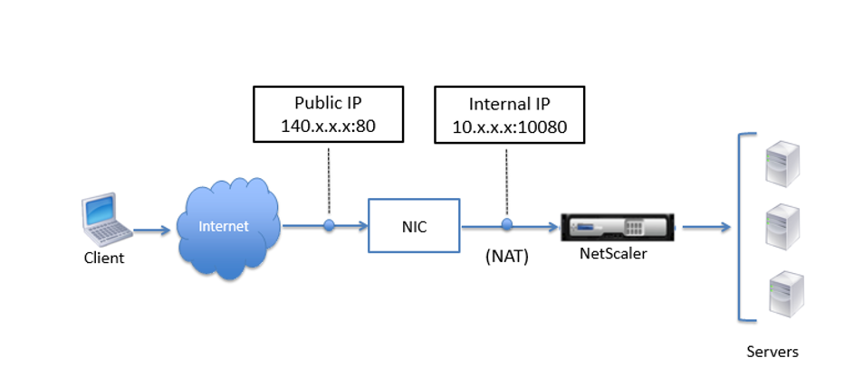

# Module1: NetScaler Instantiation

## Shortcuts
Go Back to [Table of Contents](../)
Go to [Module 2](../Module2)

## Module Overview

In this module you will login to your Azure account and instantiate a NetScaler VPX for us in Application Delivery for HTTPS Encryption Offload, TCP Proxy, Load Balancing and Content Switching, Rewrite, VPN, ICA Proxy, Web Logging, Content Switching, Content Filtering, Responder, HTML Injection, Web Interface on NS, and AppFlow.

Our latest software for NetScaler is 11.1, and the associated and most current documentation for NetScaler VPX on Azure is available on this link:[ https://docs.citrix.com/en-us/netscaler/11-1/deployingvpx/deploy-vpx-on-azure.html](https://docs.citrix.com/en-us/netscaler/11-1/deployingvpx/deploy-vpx-on-azure.html)

The NetScaler VPX virtual appliance is available as an image in the Microsoft Azure Marketplace. NetScaler VPX on Microsoft Azure Resource Manager (ARM) enables customers to leverage Azure cloud computing capabilities and use NetScaler load balancing and traffic management features for their business needs. You can deploy NetScaler VPX instances on Azure Resource Manager either as standalone instances or as high availability pairs in active-active or active-standby modes.

In ARM, a NetScaler VPX virtual machine (VM) resides in a virtual network. A virtual Network Interface Card (NIC) is created on each NetScaler VM. The network security group (NSG) configured in the virtual network is bound to the NIC, and together they control the traffic flowing into the VM and out of the VM. 

The NSG forwards the requests to the NetScaler VPX instance, and the VPX instance sends them to the servers. The response from a server follows the same path in reverse. The NSG can be configured to control a single VPX VM, or, with subnets and virtual networks, can control traffic in multiple VPX VM deployment. 

The NIC contains network configuration details such as the virtual network, subnets, internal IP address, and Public IP address.

While on ARM, it is good to know the following IP addresses used to access the VMs:

  * Public IP (PIP) address is the Internet-facing IP address configured directly on the virtual NIC of the NetScaler VM. This allows you to directly access a VM from the external network without the need to configure inbound and outbound rules on the NSG.

  * NetScaler IP (NSIP) address is internal IP address configured on the VM. It is non-routable.

  * Virtual IP address (VIP) is configured by using the NSIP and a port number. Clients access NetScaler services through the PIP address, and when the request reaches the NIC of the NetScaler VPX VM or the Azure load balancer, the VIP gets translated to internal IP (NSIP) and internal port number.
  * Internal IP address is the private internal IP address of the VM from the virtual network’s address space pool. This IP address cannot be reached from the external network. This IP address is by default dynamic unless you set it to static. Traffic from the internet is routed to this address according to the rules created on the NSG. The NSG works with the NIC to selectively send the right type of traffic to the right port on the NIC, which depends on the services configured on the VM. 

In this document, PIP, VIP, and Instance Level PIP (ILPIP) mean the same thing and are used interchangeably. 

The following figure shows how traffic flows from a client to a server through a NetScaler VPX instance provisioned in ARM.

## How NetScaler VPX Works on Azure

In an on-premises deployment, a NetScaler VPX instance requires, at least three IP addresses:

* Management IP address, called the NetScaler IP (NSIP) address

* Subnet IP (SNIP) address for communicating with the server farm

* Virtual server IP (VIP) address for accepting client requests

In an Azure deployment, only one IP address is assigned to an instance during provisioning through DHCP, and it is a private (internal) address.

Although you can provision a NetScaler VPX instance in Azure with multiple NICs, the multiple NIC feature has a few constraints that might make the instance unresponsive. For details about this constraint, see [Limitations and Usage Guidelines](http://docs.citrix.com/en-us/netscaler/10-5/vpx/deploy-vpx-on-azure.html)

To avoid this limitation, you can deploy NetScaler VPX instance in Azure with a single IP architecture, where the three IP functions of a NetScaler appliance are multiplexed onto one IP address. This single IP address uses different port numbers to function as the NSIP, SNIP, and VIP. 

The following image illustrates how a single IP address is used to perform the functions of NSIP, SNIP, and VIP.

> Note: The single IP mode is available only in Azure deployments. This mode is not available for a NetScaler VPX instance on your premises, on AWS, or in in other type of deployment.

## Traffic Flow through Port Address Translation

In an Azure deployment, when you provision the NetScaler VPX instance as a virtual machine (VM), Azure assigns a Public IP address and an internal IP address (non-routable) to the NetScaler virtual machine. Inbound and Outbound rules are defined on the NSG for the NetScaler instance, along with a public port and a private port for each rule defined. The NetScaler instance listens on the internal IP address and private port. 

Any external request is received on the NetScaler VPX VM's virtual NIC. The NIC is bound to the NSG, which specifies the private IP and private port combination into which to translate the request's destination address and port (the Public IP address and port). ARM performs port address translation (PAT) to map the Public IP address and port to the internal IP address and private port of the NetScaler virtual machine, and forwards the traffic to the virtual machine. 

The following figure shows how Azure performs port address translation to direct traffic to the NetScaler internal IP address and private port. 

In this example, the Public IP address assigned to the VM is 140.x.x.x, and the internal IP address is 10.x.x.x. When the inbound and outbound rules are defined, public HTTP port 80 is defined as the port on which the client requests are received, and a corresponding private port, 10080, is defined as the port on which the NetScaler virtual machine listens. The client request is received on the Public IP address 140.x.x.x at port 80. Azure performs port address translation to map this address and port to internal IP address 10.x.x.x on private port 10080 and forwards the client request.

For information about port usage guidelines while, see [Port Usage Guidelines](http://docs.citrix.com/en-us/netscaler/10-5/vpx/deploy-vpx-on-azure.html)

For information about NSG and access control lists, see [https://azure.microsoft.com/enin/documentation/articles/virtual-networks-nsg/](https://azure.microsoft.com/enin/documentation/articles/virtual-networks-nsg/).   

## Traffic Flow Through Network Address Translation 

You can also request a Public IP (PIP) address for your NetScaler virtual machine (instance level). If you use this direct PIP at the VM level, you need not define inbound and outbound rules to intercept the network traffic. The incoming request from the Internet is received on the VM directly. Azure performs network address translation (NAT) and forwards the traffic to the internal IP address of the NetScaler instance.

The following figure shows how Azure performs network address translation to map the NetScaler internal IP address. 

In this example, the Public IP assigned to the NSG is 140.x.x.x and the internal IP address is 10.x.x.x. When the inbound and outbound rules are defined, public HTTP port 80 is defined as the port on which the client requests are received, and a corresponding private port, 10080, is defined as the port on which the NetScaler virtual machine listens. The client request is received on the Public IP address (140.x.x.x). Azure performs network address translation to map the PIP to the internal IP address 10.x.x.x on port 10080, and forwards the client request. 

> Note: NetScaler VPX VMs in high availability are controlled by external or internal load balancers that have inbound rules defined on them to control the load balancing traffic. The external traffic is first intercepted by these load balancers and the traffic is diverted according to the load balancing rules configured, which has backend pools, NAT rules, and health probes defined on the load balancers.

## Port Usage Guidelines

You can configure additional inbound and outbound rules n NSG while creating the NetScaler virtual machine or after the virtual machine is provisioned. Each inbound and outbound rule is associated with a public port and a private port. 

Before configuring NSG rules, note the following guidelines regarding the port numbers you can use:

1. The following ports are reserved by the NetScaler virtual machine. You cannot define these as private ports when using the Public IP address for requests from the Internet.  Ports 21, 22, 80, 443, 8080, 67, 161, 179, 500, 520, 3003, 3008, 3009, 3010, 3011, 4001, 5061, 9000, 7000. 

     However, if you want Internet-facing services such as the VIP to use a standard port (for example, port 443) you have to create port mapping by using the NSG. The standard port is then mapped to a different port that is configured on the NetScaler for this VIP service. 
 
     For example, a VIP service might be running on port 8443 on the NetScaler instance but be mapped to public port 443. So, when the user accesses port 443 through the Public IP, the request is actually directed to private port 8443.

2. Public IP address does not support protocols in which port mapping is opened dynamically, such as passive FTP or ALG.

3. Azure load balancer does not work with Public IP address. High availability does not work for traffic that uses PIP associated with VPX instance instead of PIP configured on the load balancer. For more information about configuring NetScaler VPX HA in ARM, see [Configuring NetScaler VPX in High Availability Mode in Azure](https://docs.citrix.com/en-us/netscaler/11/getting-started-with-vpx/deploy-vpx-on-azure/configure-ha-vpx-azure.html). 

4. In a NetScaler Gateway deployment, you need not configure a SNIP address, because the NSIP can be used as a SNIP when no SNIP is configured. You must configure the VIP address by using the NSIP address and some nonstandard port number. For call-back configuration on the backend server, the VIP port number has to be specified along with the VIP URL (for example, “https://gatewayFQDN:port”). 

> Note: In ARM, a NetScaler VPX VM is associated with two IP addresses. Public IP address and Internal IP address. While the external traffic connects to the PIP, the internal IP address or the NSIP is nonroutable. To configure VIP in VPX, use this combination of internal IP address and port number.

### Example: 

If the VPN virtual server FQDN is vip.test.com, and the VPN virtual server is running on port 8443, the call-back URL will be: https://vip.test.com:8443. 