# Module 2: Azure Prerequisite Configs for NetScaler

## Shortcuts

Go Back to [Table of Contents](../)
Go to [Module 3](../Module3)

## Overview

Provision a single instance of NetScaler VPX in ARM portal in a standalone mode by creating the virtual machine and configuring other resources.

### In this excercise you will:

* Configure a resource group

* Configure a network security group

* Configure virtual network and its subnets

* Configure a storage account

* Configure an availability set

**Estimated time to complete this exercise:** 40 minutes

### Before You Begin

Make sure that you have the following:

* A Microsoft Azure user account 

* Access to Microsoft Azure Resource Manager 

* Microsoft Azure SDK (optional)

* Microsoft Azure PowerShell (optional) [https://docs.citrix.com/en-us/netscaler/11-1/deploying-vpx/deploy-vpx-onazure/vpx-azure-appendix.html](https://docs.citrix.com/en-us/netscaler/11-1/deploying-vpx/deploy-vpx-onazure/vpx-azure-appendix.html) 

### Virtual Machines Required For This Module

**Citrix NetScaler VPX Bring Your Own License**

### Step by Step Guidance

On the Microsoft Azure Portal page (https://portal.azure.com), log on to the Azure Resource Manager portal by providing your user name and password. (In the ARM portal, clicking an option in one pane opens a new pane to the right. Navigate from one pane to another to configure your device.)

### Configuring a Resource Group

1. Create a new resource group that is a container for all your resources. Use the resource group to deploy, manage, and monitor your resources as a group.

    Click **New** and search for **resource group**

    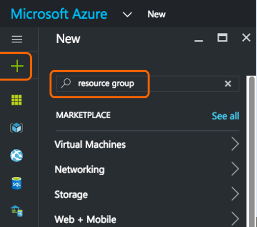 

2.  Select the "Resource group" item.

    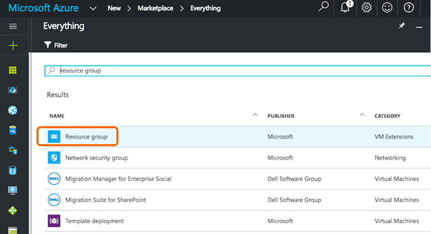

3. Click Create.

    

4. In the ** Resource group** pane, enter the following details:

    * Resource group name

    * Resource group location

    Click ** Create**.

     

    ...and your Resource group is shown:

     

### Configuring a Network Security Group

1.  Create a network security group (NSG) to assign inbound and outbound rules to control the incoming and outgoing traffic within the virtual network. NSG allows you to define security rules for a single virtual machine and also to define security rules for a virtual network subnet.

    Click **New** and search on **network security group**.

    

    Select the Network security group 

    

2.  Click Create.

    

3.  In the ** Create network security group** pane, enter the following details, and then click ** Create**. 

      * Name – type a name for the security group

      * Resource group – select the resource group from the drop-down list

     Click ** Create**.

     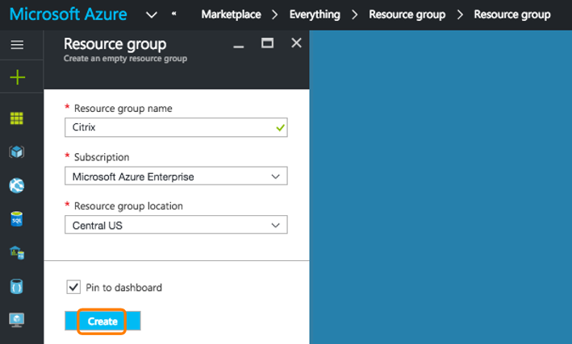

     ...and your Network security group is shown.

     

### Configuring a Virtual Network and Subnets

1.  Virtual networks in ARM provide a layer of security and isolation to your services. VMs and services that are part of the same virtual network can access each other. For example, create a virtual network with a reserved CIDR block of 192.168.0.0/16 and two subnets having CIDR blocks as 192.168.1.0/24 and 192.168.2.0/24 respectively.

    NetScaler uses only 1 IP at this time and will not leverage the multiple Subnets in this lab, but it is good for Azure familiarity to proceed.

    Click **New > Networking > Virtual Network**

    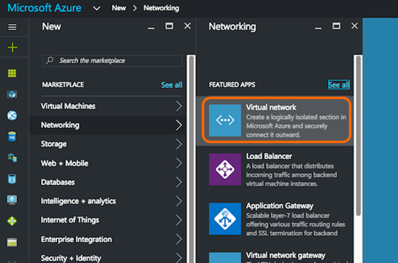

    In the **Virtual Network** pane, select **Resource Manager** from the drop-down list and click **Create**.

    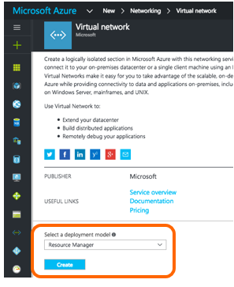

2. In the ** Create virtual network pane**, enter the following values, and then click ** Create**.

	* Name of the virtual network

	* Address space – type the reserved IP address block for the virtual network
	
	* Subnet – type the name of the first subnet (you will create the second subnet later in this step)
	
	* Subnet address range – type the reserved IP address block of the subnet
	
	* Resource group – select the resource group created earlier from the drop-down list

	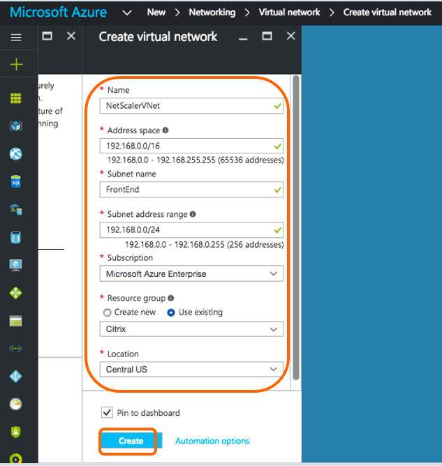

3. Deployment Succeeded. Click Subnets for the next step.

    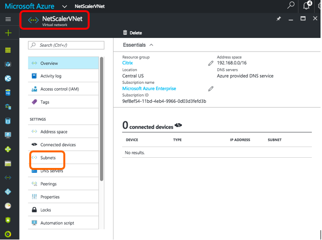

4.  **Configuring the second subnet**

    Select the newly created virtual network from All resources pane.

    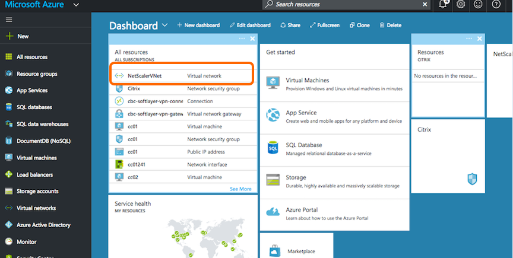

    and in the **Settings pane**, click **Subnets**.

    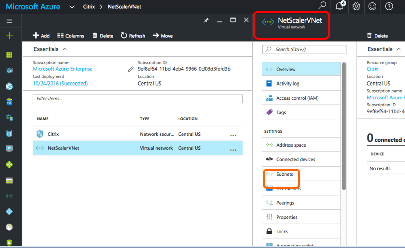

5. Click **+Subnet**

    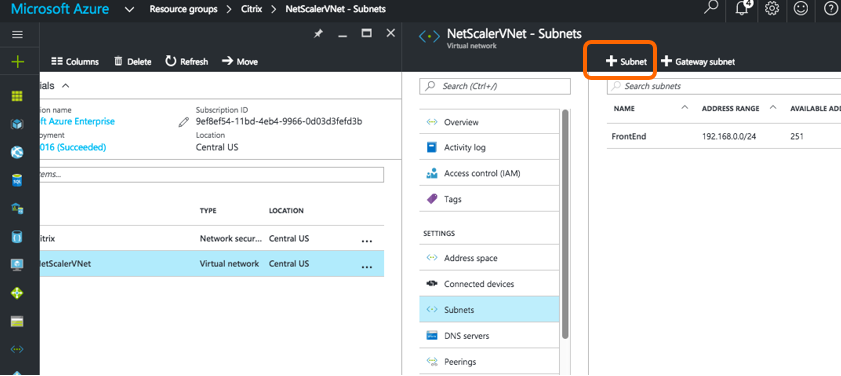

    Create the second subnet by entering the following details:

     * Name of the second subnet

	 * Address range – type the Reserved IP address block of the second subnet

	 * Network security group – select the NSG from the drop-down list

	 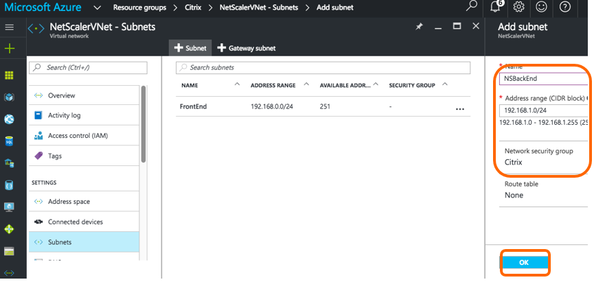

	 ... and it appears in the list.

	  

### Configuring a Storage Account

1. The ARM IaaS infrastructure storage includes all services where we can store data in the form of blobs, tables, queues, and files. You can also create applications using these forms of storage data in ARM.

    Create a storage account to store all your data.

    Click **+New > Storage > Storage account**.

    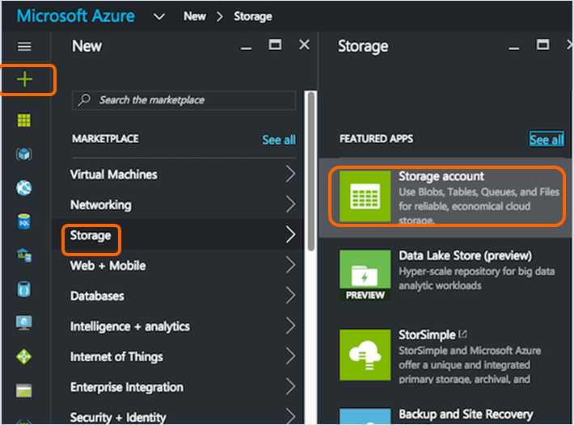

2.  In the Create storage account pane, enter the following details:

      * Name of the account

      * Deployment mode – make sure to select Resource Manager

      * Account kind – select General purpose from the drop-down list
      
      * Replication – select Locally redundant storage from the drop-down list

      * Resource group – select the newly created resource group from the drop-down list
      
      * Performance – Premium (NetScaler VPX requires Premium to provision)

    Click **Create**.

    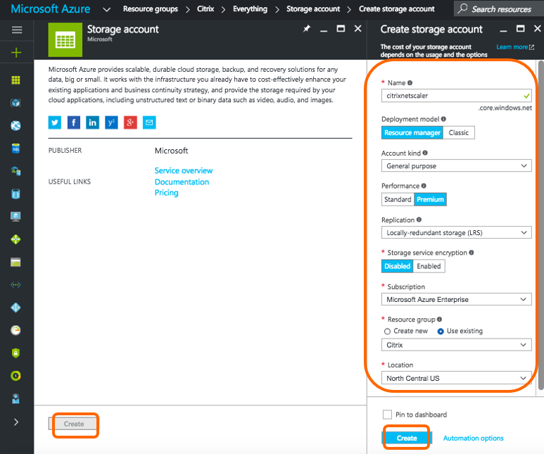

    The storage account will appear when complete

    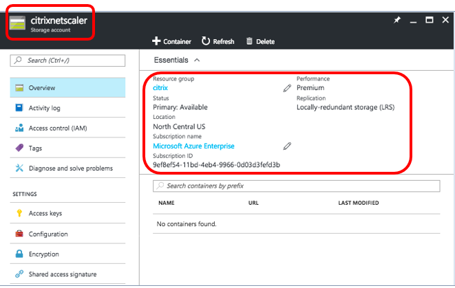

### Configuring an Availability Set

1. An availability set guarantees that at least one VM is kept up and running in case of planned or unplanned maintenance. Two or more VMs under the same ‘availability set’ can be placed on different fault domains to achieve redundant services.

    Click **+New** and search for availability set. 

    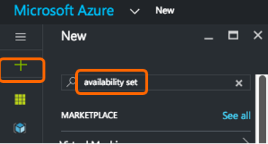

    Select **Availability set** entity from the list. Click **Create**.

    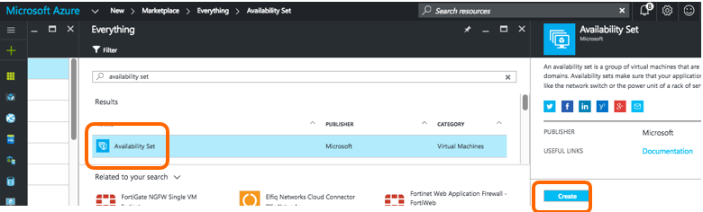

2. In the Create availability set pane, enter the following details:

     * Name of the set

     * Resource group – select the newly created resource group from the drop-down list

    Click **Create**.

    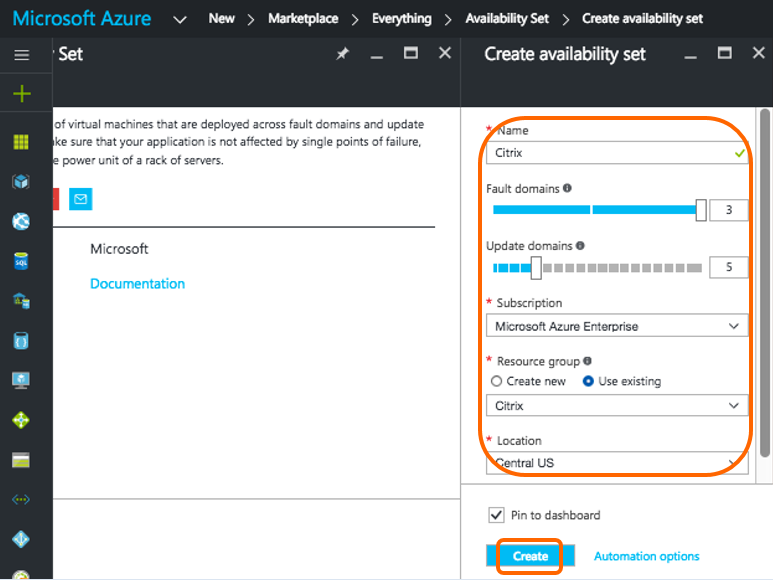

    The Availability set will appear when complete.

    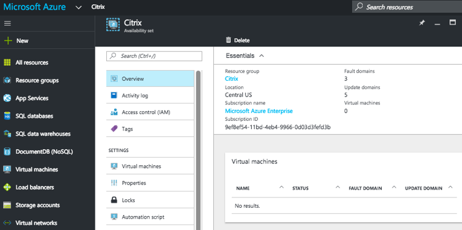

### Module Summary

You have the Azure Environment ready and have:

* Configured a resource group 

* Configured a network security group 

* Configured virtual network and its subnets 

* Configured a storage account 

* Configured an availability set 

 

