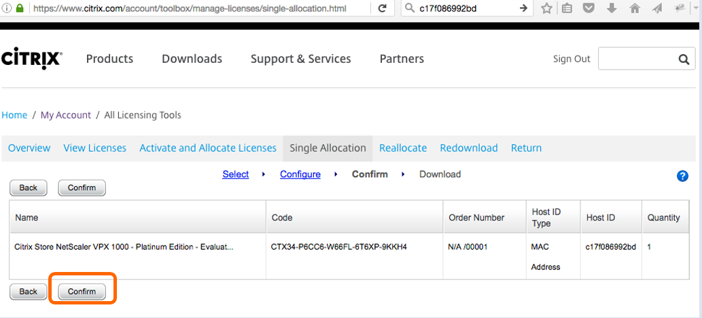
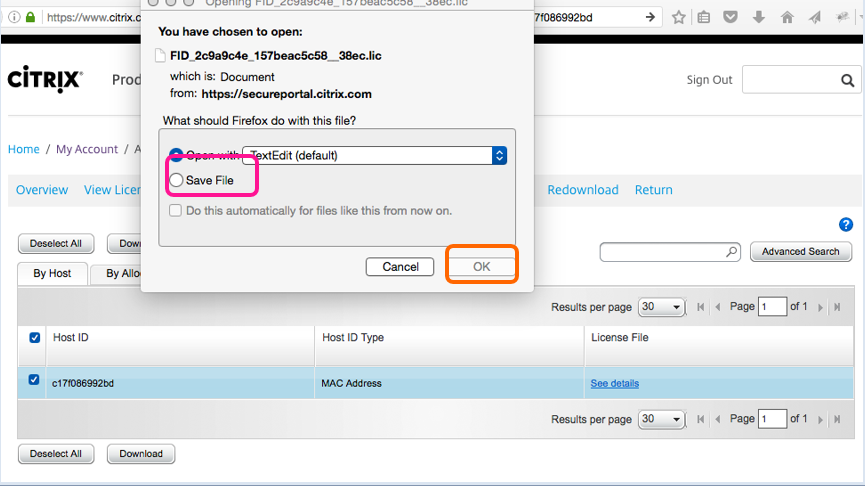

# Module 3: Provision the NetScaler

## Overview

Provision a single instance of NetScaler VPX in ARM portal in a standalone mode by creating the virtual machine and configuring other resources.

## In this exercise you will:

Configure a NetScaler VPX instance

**Estimated time to complete this exercise:** 50 minutes

## Virtual Machines Required for this Exercise

**Citrix NetScaler VPX Bring Your Own License**

### Step by Step Guidance

1. **Configuring a NetScaler VPX Instance**

    Create an instance of NetScaler VPX in the virtual network. Obtain the NetScaler VPX image from the Azure marketplace, and then use the Azure Resource Manager portal to create a NetScaler VPX instance. 

    Before you begin creating the NetScaler VPX instance, make sure that you have created a virtual network with required subnets in which the instance will reside. You can create virtual networks during VM provisioning, but without the flexibility to create different subnets. For information about creating virtual networks, see http://azure.microsoft.com/en-us/documentation/articles/create-virtual-network/.

    **Note:** Citrix recommends that you create resource group, network security group, virtual network, and other entities before you provision the NetScaler VPX VM, so that the network information is available during provisioning. 

2. Click **+New > Networking.**

    Click **See All** and in the Networking pane, click **Citrix NetScaler VPX Bring Your Own License.**

    As a quick way to find any entity on ARM portal, you can also type the name of the entity in the Azure Marketplace search box and press **<Enter>**. Type NetScaler in the search box to find the Citrix NetScaler images.

    

3. Select NetScaler 11.0 VPX bring Your Own License.

    Note: Ensure to select the latest image. Your Citrix NetScaler image might have the release number in the name.

    

    Click **Create**

4. Configure Basic Settings. I used **Password1!go** as my password. On Azure, you set the superuser. There is no nsroot default.

    

5. Select a size. NetScaler needs 2 Cores minimum. I chose DVS_V2, which might cost ~14 cents per hour.

    

6. Populate your details.

    

    Showing larger screen captures from above:

    

7. Click Ok.

    

8. Now I can Purchase and Deploy my NetScaler, after passing Validation above.

    

9. Here is the final screen with the overvview of the NetScaler VPX
 
    

    

10. It is recommended to set your IP Addresses to Static. Click on the IP to view configuration. Select Static and then Save. 

    

11. For Licensing, BYOL is available for customers with NetScaler Gateway VPX or NetScaler VPX 10, VPX 200 and VPX 1000 licenses purchased via other channels from Citrix (https://azure.microsoft.com/en-us/marketplace/partners/citrix/netscalervpx110-6531/).

    For our purpose, a 90-day trial VPX License will work. Let’s hit this site, https://www.citrix.com/products/netscaler-adc/get-started.html, and click on “Download now.

    

12. Enter an email and the system will email you, and reveal, a license code. 

    

13. There we have it. I believe it will email to me, but I want the code on the screen. It will be unique for you. Mine is: CTX34-P6CC6-W66FL-6T6XP-9KKH4.

    

14. Now we go in another direction and log into citrix.com with a non-citrix-employee account. This link is where we will join the license code and the NetScaler Instance’s Host ID. https://www.citrix.com/account/toolbox/manage-licenses/single-allocation.html. 

    

15. We need to log into the NetScaler using the IP we made static above, 13.89.51.171. First, let’s create an allow policy in our Network Security Group for SSH to come in. In the screen shot below, I found the Network securuty group that we earlier bound to the NIC on the NetScaler VM.

    

    Click on Network Interfaces for your VM, the NetScaler

    

16. As we work our way to the right, down from our NetScaler VM to it’s Network interfaces, we select our IP (shown as 13.89.51.171), and to the right we select Network security group. There it is. Sure, it is the one we made in the last section, but the entities in Azure configure like this and it is good to be sure.

    Click on your Network security group (shown as Citrix).

    

17. Click Inbound security rules.

     

18. Click on add, and open SSH for example.

    

19. Now it is in the Security Group to allow inbound SSH.

    **Note:** (If you do not have a SSH client like putty, we will come back to this. Please proceed on. You must use your real and unique HOSTID. Do not generate your license with my screen example. You will see your HostID in the GUI on Step 34 below. You might go ahead to step 29, and then come back to step 22..)

    

20. So I SSH into my NetScaler on the same IP with username Citrix and Password Password1!go. “$ssh citrix@13.89.51.171”. I see a familiar command line interface and I ask it to show version. NetScaler 11.x. Nice….

    

21. The reason I came this way was to get access to the CLI, and Shell, so I could get the HostID and generate my license. The command to get the MAC Address in use by the licensing task is “shell lmutil lmhostid –ether”. I get back: c17f086992bd.. I got my License Key in step 13: CTX34-P6CC6-W66FL-6T6XP-9KKH4. If I still have that citrix.com window open from Step 14, I can use these 2 things to generate my license.

    

22. https://www.citrix.com/account/toolbox/manage-licenses/single-allocation.html

    

23. The site prompts me to select the license I want to work with, so I paste my HOSTID in the search field for convenience.

     

24. The system knows you have a VPX Platinum 1000 License. It is guiding you to put in a MAC address. Some confusion was seen between the Universal License, which goes against the Hostname, and the Platform License, which goes against the HOSTID, which is a MAC Address.

    Click **Continue**.

    

25. Click **Confirm**.

    

26. Click **OK** to download license files.

    

27. Save the file to downloads.

    

28. We can open it with a text editor anytime to validate the dates and the HostID.

    

29. Let’s go back and open a port 80 for NSIP/GUI Access. The NetScaler in Azure to date uses a single IP mode, so the IP we have is our NSIP, SNIP, and VIP. We need to open an Inbound port 80 like you did in Step 19. Do it for HTTP (CP/80).

    

30. Launch a browser to your NetScaler IP, like this:

    

    The username is what we set in step 4. I had citrix and Password1!go.

     

31. Click **Skip**.

     

32. Remember, no need to create a SNIP. It is unsupported in Azure today, so skip step here and go straight to the license point. 

     

    Click the SNIP part and select “Do it later”. 

    

33. Now you can scroll down and click licenses, or skip this wizard and load your license another way. For this run, lets load the license now. Click on Licenses.

    

34. In this version, we share the Host ID on this page, so if you skipped the SSH step, you can pick back up now. You need your unique HOSTID. Here it is. If you have not yet been able to get your license started, head back to step 22 and catch back up.

    Click **Browse**.

    

35. After clicking Browse, I looked in my downloads folder and found the license file, selected it, and clicked open.

    

36. Click **Reboot**.

    

37. Save the configuration.

    

38. The GUI will count down and reconnect for you.

    

39. Log back in with the same credentials as step 30.

    

40. The system software still runs the wizard at you until you add the SNIP. Skip it again. Click Licenses.

    

41. I had to click on ‘Licenses’ and then ‘Do It Later’ before it would offer up a continue button.

    

    Click **Continue**.

    

42. We’re in, and the GUI presents us a screen of all the Licensed Features. We are ready to proceed.

    

43. This brings you to the Main Configuration screen. It gives us the HOSTID again.  

    

### Exercise Summary

Now you have a NetScaler VPX1000 in Azure for 90 days of the full Platinum Feature set. Thank you for setting this baseline. You can go a lot of directions from here. Take a look at the resources and deployment guides to implement several popular applications.

