# Module 4: Configure the NetScaler

## Shortcuts

Go Back to [Table of Contents](../)
Go to [Appendix](../LabGuideAppendix)

## Overview

Configure your NetScaler as the Reverse Proxy.

## In this exercise you will:

Configure your NetScaler VPX instance and pass traffic

**Estimated time to complete this exercise:** 30 minutes

## Virtual Machines Required for this Exercise

**Citrix NetScaler VPX Bring Your Own License**

### Step by Step Guidance

1. Where did we leave off? We had the VM turned up with SSH and HTTP GUI access, and we put a Platinum VPX1000 license on.

    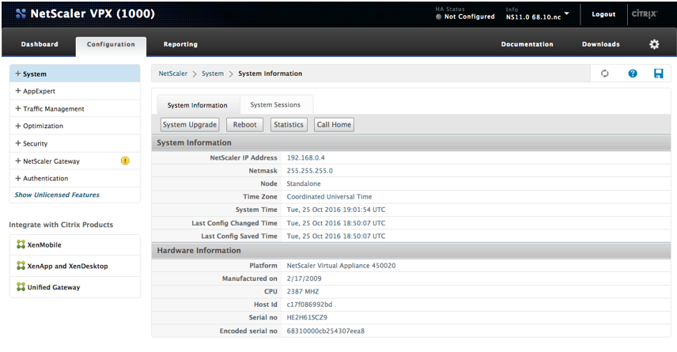

2. Expand the Traffic Management node, and **right click** on Load Balancing to “Enable Feature”.

    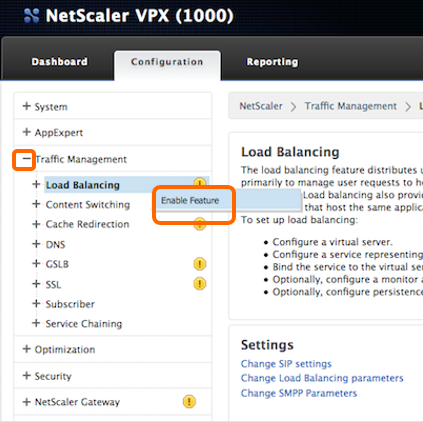

3. Now you are enabled (no yellow! circle).

    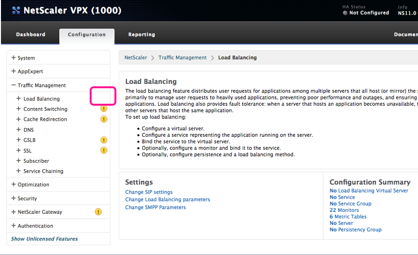

4. Expand the Load Balancing node and select Services. Click Add.

    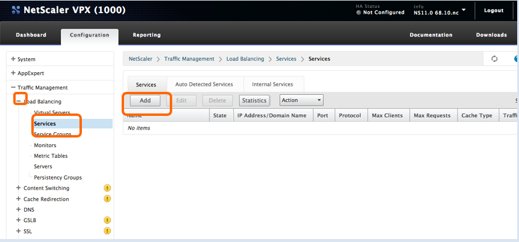

5. I can resolve DNS for time.gov. We can use the IP, 132.163.4.22, for a quick service to proxy.

    

6.  Add a name, the IP, and click ok.   

    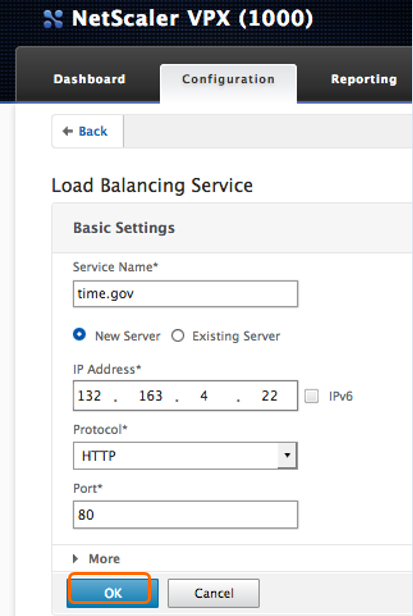

7. We see it as up, and know the default TCP 3way handshake Monitor is passing.

    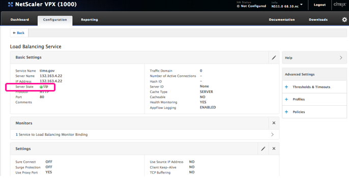

8. Next, lets add a vServer to bring the traffic through the NetScaler. Under the Traffic Management node, click on Virtual Servers and Add.

    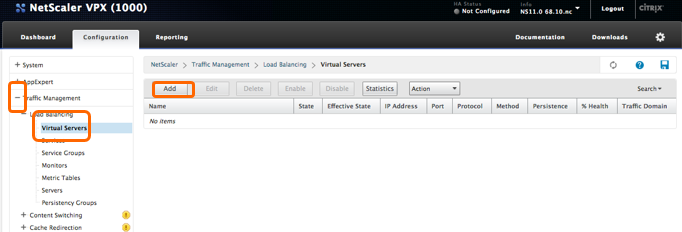

9. You only have one IP in Azure at the current time. Use that IP, the one on the NetScaler, **not the public IP** that Azure mapped to your NetScaler. Lets verify what IP that is again… Look under System, Network, and IPs to confirm, or type “ship” in your SSH session.

    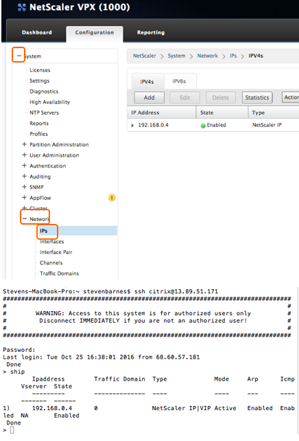 

10. Configure your vServer with the NetScaler’s IP for step 8. Lets do port 81. I named it citrix.com, but the field is arbitrary and not resolved. Click OK. 

    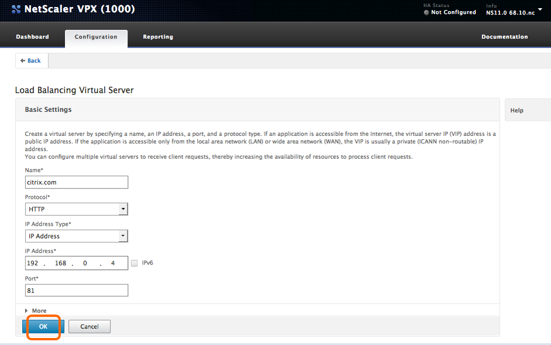

11. **Remember:** Do not use any of these ports or you will get a duplication error, as these ports are reserved for NetScaler when in Single IP mode.

    **Ports:** 21, 22, 80, 443, 8080, 67, 161, 179, 500, 520, 3003, 3008, 3009, 3010, 3011, 4001, 5061, 9000, 7000.

    **Reference:** https://docs.citrix.com/en-us/netscaler/11-1/deploying-vpx/deploy-vpx-on-azure.html. 

12. Click on the words “No Load Balancing Virtual Server Service Binding”.

    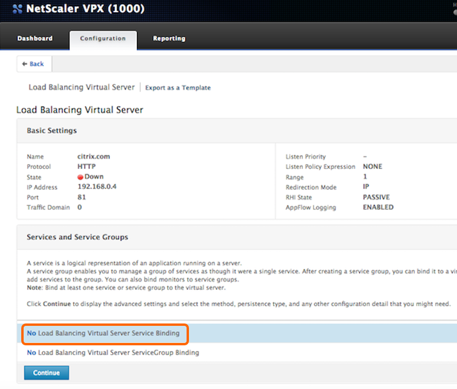

13. Click on the > to select.  

    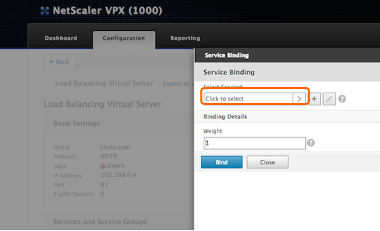

14. Select our Service for time.gov, which is on port 80, but it is ok to have different ports on the front and back of NetScaler, which is a Secure TCP Proxy.

    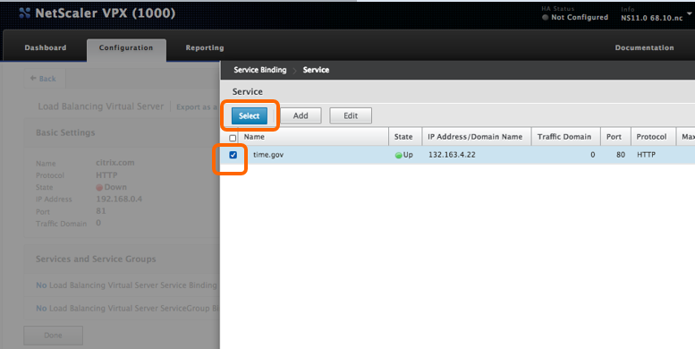

15. Then Bind

    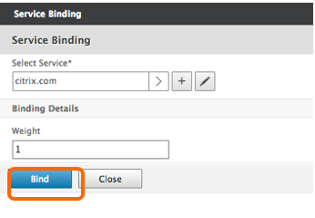

16. Now you see your vServer, and it says red/down….    But it will refresh on the HTML5 page.

    Go ahead and click Continue.

    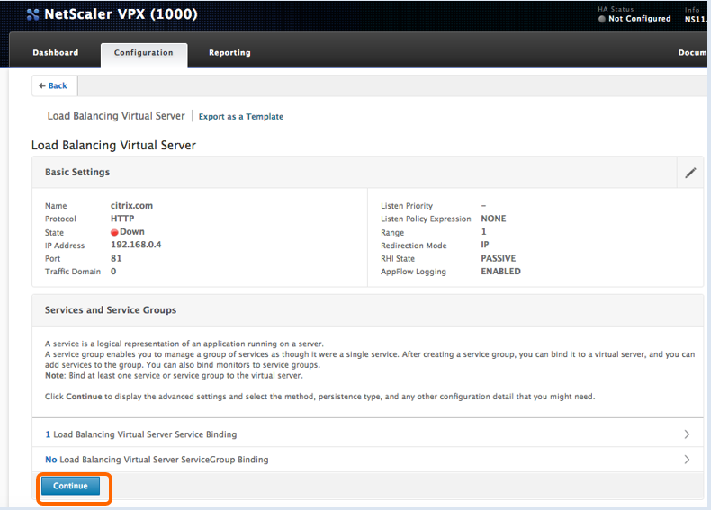

17. Click Done.

    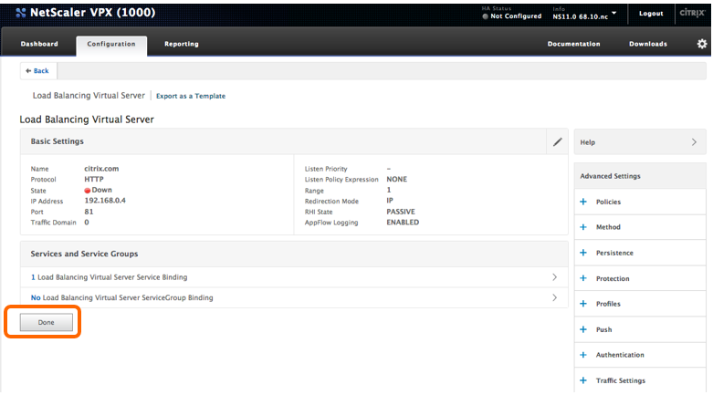

18. Click the Refresh and Save Icon.

    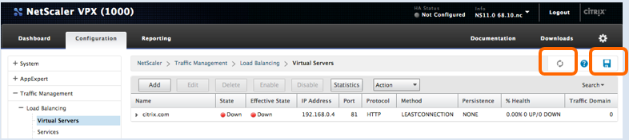

19. After refreshing we see the accurate state is up with 1/1 service available.  

    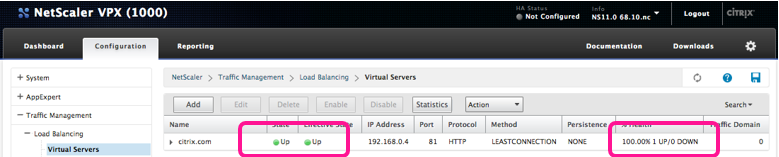

20. To test, you could surf to the IP, and remember, our vServer is on Port 81, so we will need to open a port in the Azure Security group, like we did for SSH and HTTP80. Click the +.

    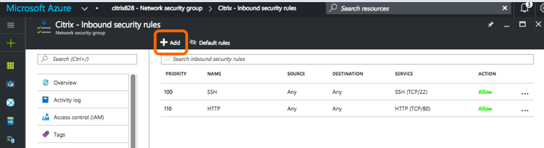

21. Spec it out and click OK. I called mine citrix.com, and specified port 81, Custom, and allow.

    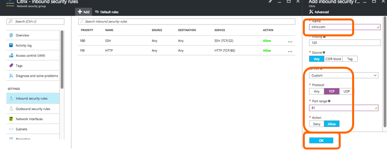

22. Navigate to the NetScaler vServer on port 81, http://13.89.51.171:81. We are proxying the TCP connections from the client browser to the vServer on the NetScaler at 13.89.51.171 on port 81, to time.gov on port 80

    

### Exercise Summary

Now your NetScaler is passing some traffic. You’re seeing the potential of the Secure Reverse Proxy and can add encryption, offload, high availability and scaling, enable the security features, DDoS Protection, and much more.

